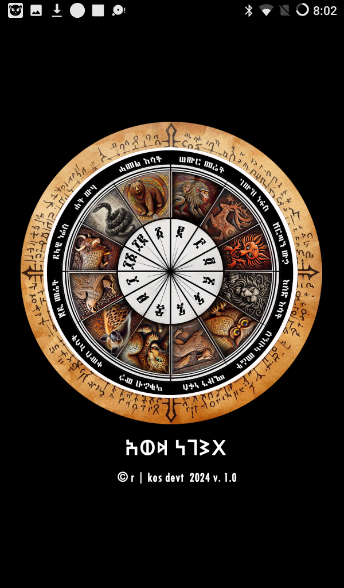
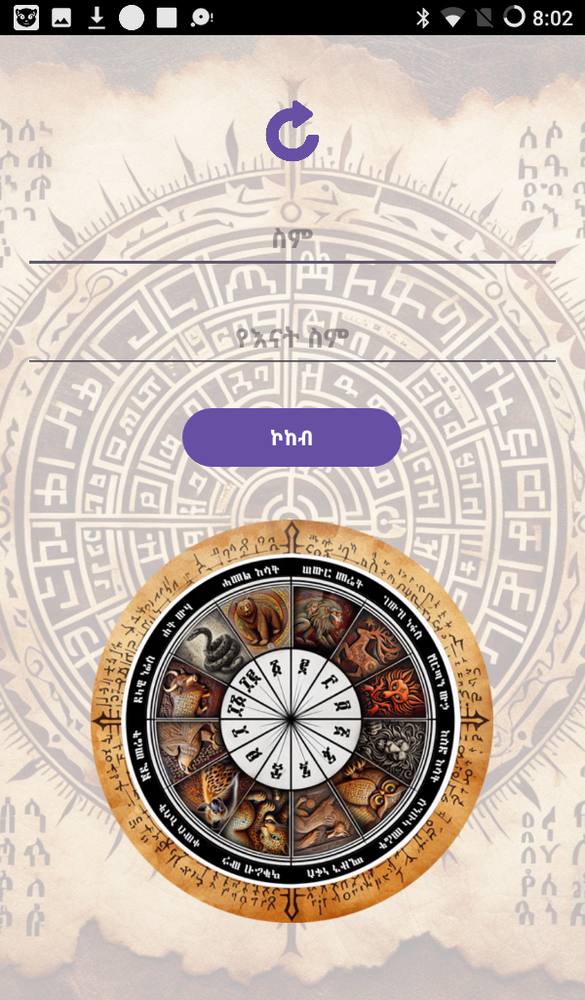
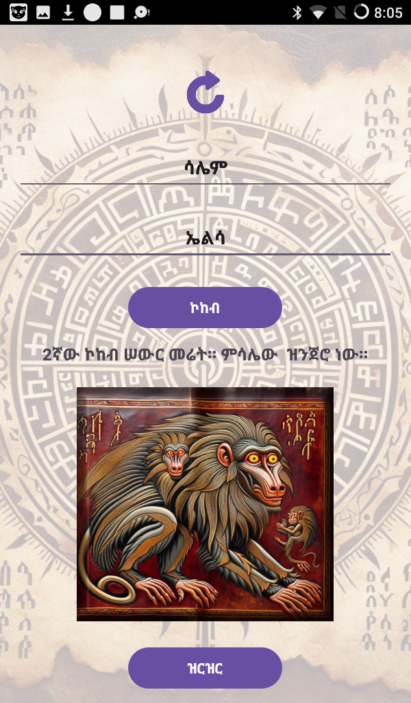

# Awde Negest
Ancient Ethiopian Horoscope Application

Awde Negest is a mysterious and ancient Ethiopian horoscope app designed for Amharic readers. The application provides personalized zodiac readings based on users’ first names and their mothers’ names written in Amharic script. It combines traditional Ethiopian astrology with modern interactive graphics for a unique and engaging experience.

## Features

### Name-Based Horoscope
Users input:
- Their first name
- Their mother’s name  

The app calculates the user’s zodiac sign from 12 unique signs using a traditional Ethiopian letter-to-number mapping system.

### Zodiac Sign Details
Each zodiac sign includes:
- Symbolic animal representation
- Personality traits
- Life insights
- Detailed readings for various aspects of life

### Interactive Graphics
- Tap each zodiac sign to view detailed readings
- Explore all zodiac signs with visually appealing graphics

### Offline & Privacy-Friendly
- Works completely offline
- No personal data is transmitted or stored externally

## Screenshots
Below are example screenshots of Awde Negest in action:

Splash Screen:  


Main Input Screen:  


Sign Selection Screen:  


Zodiac Sign Screen:  


## Releases
Prebuilt Android App Bundles (.aab) and APK files are available in the `releases` section of this repository. Users can download the latest version to install the app on their devices.

## Technology Stack

- Java (Android)
- Android Studio
- Material Design Components
- Android Jetpack components where applicable

## Installation

1. Clone the repository:
   ```bash
   git clone https://github.com/R-kos77/Awde-Negest-Ethiopian-Horoscope.git
Open the project in Android Studio.

Build and run the application on an emulator or a physical Android device.

Alternatively, download the latest .aab or .apk release from the repository and install it directly on your device.

Author: Robel Kiros
GitHub: R-Kos77
Email: robelalbeta@gmail.com
